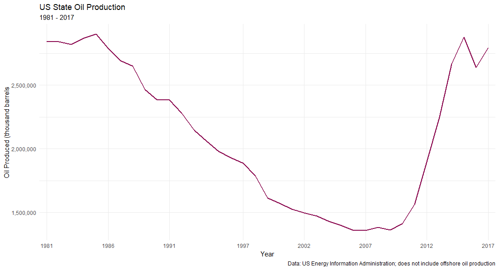
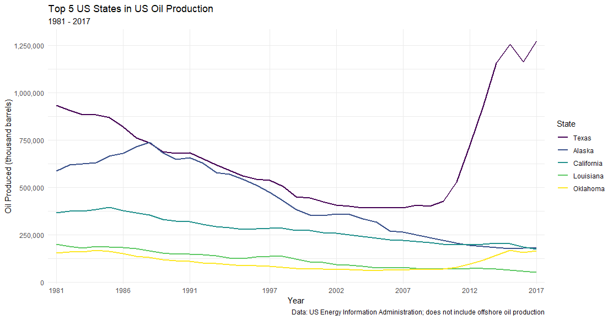
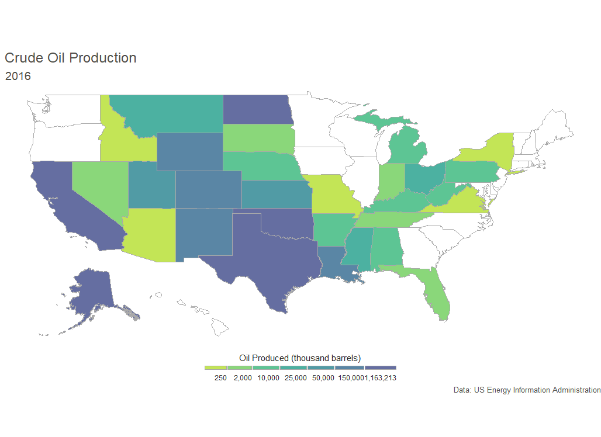

# US Crude Oil Production

For work I was asked to look at the annual crude oil production in California compared to the rest of the US. I decided to explore the data a little bit more and create some basic visualizations of what crude oil production for US states has looked like over the years. 

The data was originally downloaded from the [US Energy Information Administration website](https://www.eia.gov/dnav/pet/pet_crd_crpdn_adc_mbblpd_a.htm). Initial cleaning/formating of the dataset was done in Excel due to time constraints. Offshore crude oil production was not included. 

